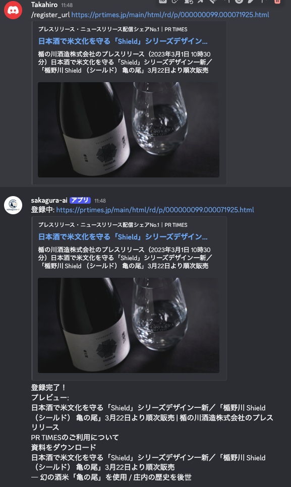
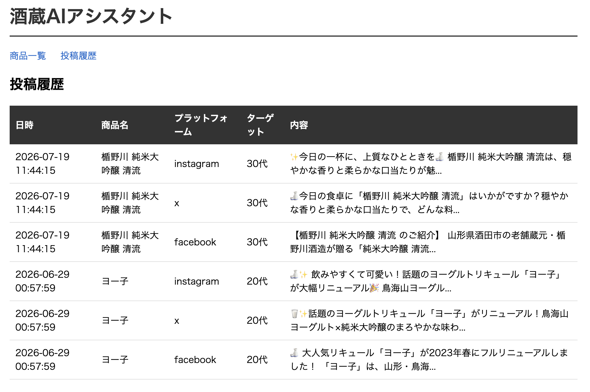
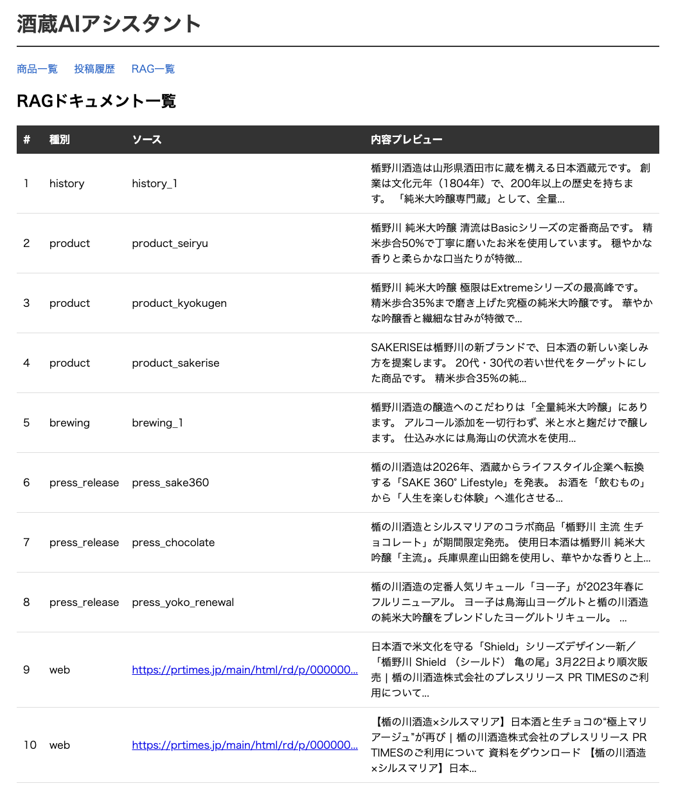
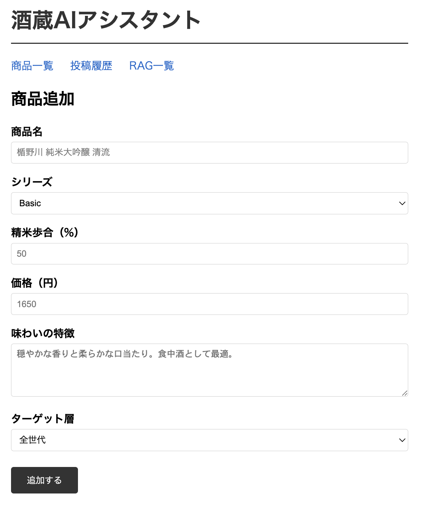
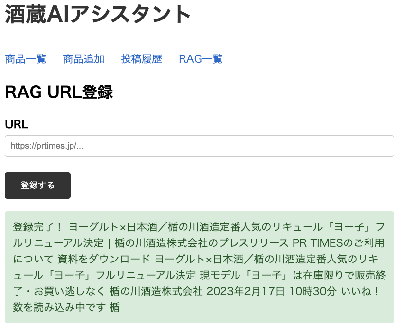
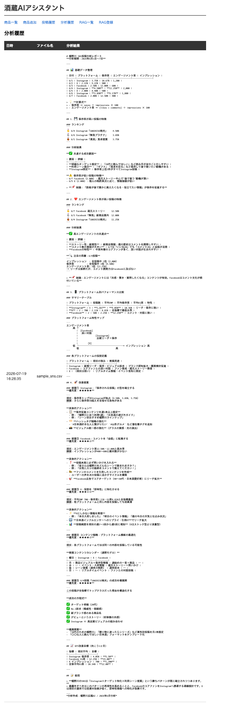

# 酒蔵AIアシスタント

楯野川酒造の広報業務をAIで効率化するDiscord Botです。

## 機能

- `/post [商品名] [ターゲット]` : Instagram・X・Facebook向け投稿文を一括生成
- `/analyze` : SNSのCSVをアップロードして投稿パフォーマンスを分析
- Webダッシュボード : 商品一覧・投稿履歴・RAG一覧をブラウザで確認
- RAG : 蔵元資料・プレスリリースを検索して投稿文に反映

## 使用例

### /post コマンド


### /register_url コマンド


### ダッシュボード







## システム構成

```
Discord
    │
Discord Bot (discord.py)
    │
    ├─ Claude API (claude-sonnet-4-6)
    │       │
    │   ChromaDB (RAG)
    │   蔵元資料・プレスリリース検索
    │
    └─ SQLite
        商品DB・投稿履歴
            │
        FastAPI Dashboard
        ブラウザで確認
```

## 技術スタック

- Python / discord.py
- Claude API (claude-sonnet-4-6)
- SQLite（商品DB・投稿履歴）
- ChromaDB（RAGベクトル検索）
- FastAPI / Jinja2

## 技術選定

### Python
AI API、Discord Bot、RAG、動画処理を同一言語で実装できるため採用しました。
AI関連ライブラリが豊富で、機能の試作と改善を迅速に行えます。

### discord.py
広報担当者が普段利用するチャット画面から、SNS投稿生成や分析を実行できるようにするため採用しました。
スラッシュコマンドにより、専用の管理画面を開かずに操作できます。

### Claude API
商品情報やブランド方針を基に、Instagram、X、Facebookなど、媒体ごとに適した広報文を生成するため採用しました。
RAGで検索した資料をプロンプトに含め、事実に基づく文章生成にも利用しています。

### FastAPI
Discord BotとWebダッシュボードで共通利用するバックエンドAPIとして採用しました。
Pythonとの親和性が高く、入力値検証やAPIドキュメントの自動生成に対応しています。

### Jinja2
商品一覧や投稿履歴などの管理画面を、FastAPIと一体で簡潔に構築するため採用しました。
小規模な業務支援ツールとして、フロントエンドを分離せず迅速に開発できる構成を選択しています。

### SQLite
現在はSQLiteを採用し、開発・デモ環境をシンプルにしています。
運用規模の拡大時には、MariaDBやPostgreSQLなどのサーバー型RDBMSへの移行を想定しています。
JSONデータやAI関連機能の要件に応じて適切なデータベースを選択します。

### ChromaDB
商品資料や酒蔵関連文書をベクトル検索し、質問や投稿内容に関連する情報を取得するため採用しました。
検索した情報をClaudeに渡すことで、酒蔵固有の情報に基づく回答と文章生成を実現しています。

### FFmpeg(未実装)
商品画像、動画素材、字幕、ロゴ、BGMを自動合成し、SNS向けの縦動画を生成するため採用します。
コマンドラインから動画処理を実行できるため、Pythonによる自動化に適していると考えます。

## セットアップ

```bash
python3 -m venv .venv
source .venv/bin/activate
pip install anthropic discord.py python-dotenv fastapi uvicorn jinja2 chromadb pypdf2
cp .env.example .env  # APIキーを設定
python3 seed.py          # 商品データ投入
python3 rag/documents.py # RAGドキュメント登録
```

## 起動方法

Discord Bot:
```bash
python3 bot/main.py
```

ダッシュボード:
```bash
python3 -m uvicorn dashboard.main:app --reload
```
