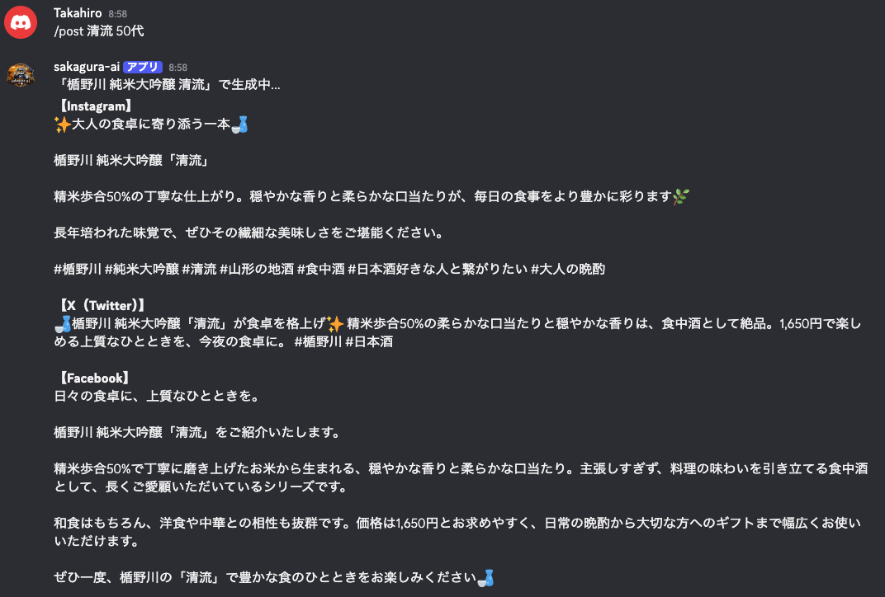
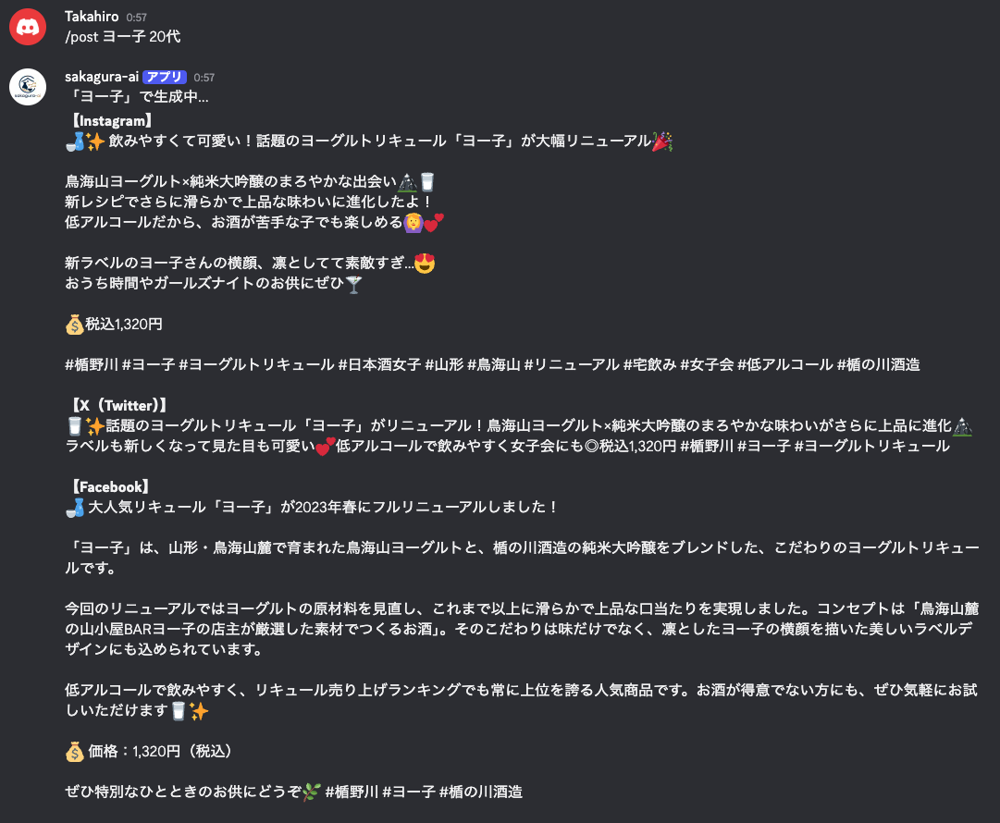
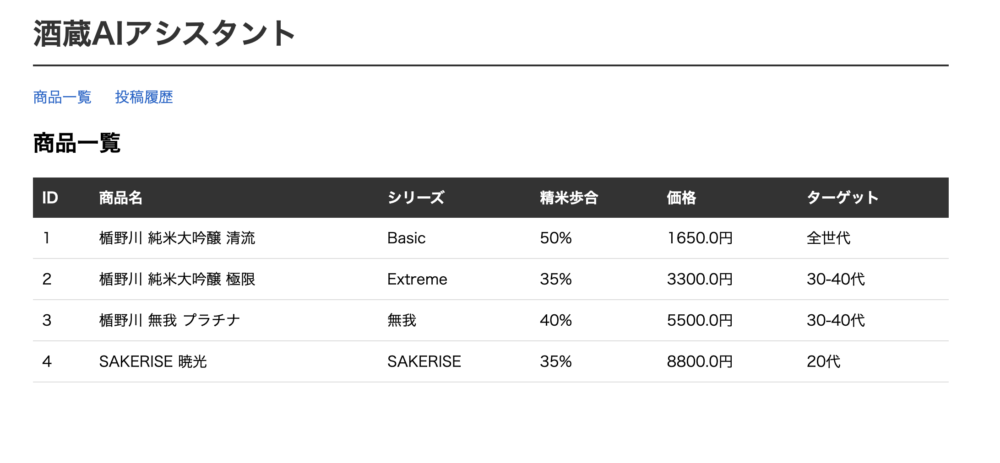

# 酒蔵AIアシスタント

楯野川酒造の広報業務をAIで効率化するDiscord Botです。

## 機能

- `/post [商品名] [ターゲット]` : Instagram・X・Facebook向け投稿文を一括生成
- `/analyze` : SNSのCSVをアップロードして投稿パフォーマンスを分析
- Webダッシュボード : 商品一覧・投稿履歴をブラウザで確認
- RAG : 蔵元資料・プレスリリースを検索して投稿文に反映

## 使用例

### /post コマンド



### ダッシュボード


## 技術スタック

- Python / discord.py
- Claude API (claude-sonnet-4-6)
- SQLite（商品DB・投稿履歴）
- ChromaDB（RAGベクトル検索）
- FastAPI / Jinja2

## セットアップ

```bash
python3 -m venv .venv
source .venv/bin/activate
pip install anthropic discord.py python-dotenv fastapi uvicorn jinja2 chromadb pypdf2
cp .env.example .env  # APIキーを設定
python3 seed.py          # 商品データ投入
python3 rag/documents.py # RAGドキュメント登録
```

## 起動方法

Discord Bot:
```bash
python3 bot/main.py
```

ダッシュボード:
```bash
python3 -m uvicorn dashboard.main:app --reload
```

## システム構成

```
Discord
    │
Discord Bot (discord.py)
    │
    ├─ Claude API (claude-sonnet-4-6)
    │       │
    │   ChromaDB (RAG)
    │   蔵元資料・プレスリリース検索
    │
    └─ SQLite
        商品DB・投稿履歴
            │
        FastAPI Dashboard
        ブラウザで確認
```