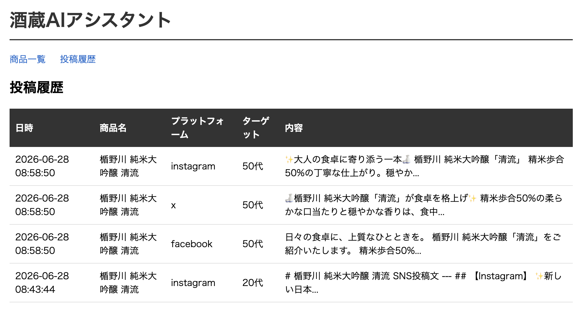

# 酒蔵AIアシスタント

楯野川酒造の広報業務をAIで効率化するDiscord Botです。

## 機能

- `/post [商品名] [ターゲット]` : Instagram・X・Facebook向け投稿文を一括生成
- `/analyze` : SNSのCSVをアップロードして投稿パフォーマンスを分析
- Webダッシュボード : 商品一覧・投稿履歴をブラウザで確認

## 使用例

### /post コマンド


### ダッシュボード



## 技術スタック

- Python / discord.py
- Claude API (claude-sonnet-4-6)
- SQLite
- FastAPI / Jinja2

## セットアップ

```bash
python3 -m venv .venv
source .venv/bin/activate
pip install anthropic discord.py python-dotenv fastapi uvicorn jinja2
cp .env.example .env  # APIキーを設定
python3 seed.py       # 初期データ投入
```

## 起動方法

Discord Bot:
```bash
python3 bot/main.py
```

ダッシュボード:
```bash
python3 -m uvicorn dashboard.main:app --reload
```

## システム構成

```
Discord
    │
Discord Bot (discord.py)
    │
Claude API (claude-sonnet-4-6)
    │
SQLite (商品DB・投稿履歴)
    │
FastAPI Dashboard
```